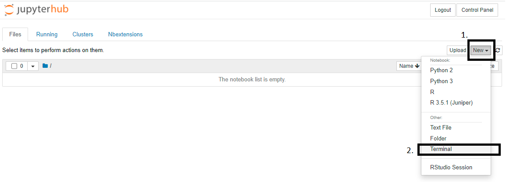

# Physics with tagged protons: exclusive di-lepton production for the 2022 CMSDAS@LPC

General information on CMSDAS 2022:
* [CMSDAS2022 main page](https://indico.cern.ch/event/1088671/)
* [All long exercises](https://twiki.cern.ch/twiki/bin/view/CMS/CMSDASAtLPC2022#LongExercises2022LPC)
* [Exercise Twiki](https://twiki.cern.ch/twiki/bin/view/CMS/SWGuideCMSDataAnalysisSchoolLPC2022TaggedProtonsLongExercise)

**Recommended:**: watch [here](https://videos.cern.ch/record/2730189) the short exercise introduction video from [CMSDAS2020](https://indico.cern.ch/e/cmsvdas2020).

## Recommended way to run the exercise 
### Getting Started (login)
This tutorial uses Jupyter Notebooks as a browser-based development environment at Vanderbilt. These Jupyter-based tutorials use a pre-configured Jupyter service usable by all CMS members.

To log in, access the [login](https://jupyter.accre.vanderbilt.edu/) page and login using your CERN credentials. 

Once you successfully connect,  click the `New` box at the top right, then the `Terminal` option as shown bellow:


#### Upload grid certificates

We will copy your grid certificates from the LPC cluster, to do this, execute the follosing commends in the terminal to copy your certificate from the LPC to Jupyter (note: replace `username` with your `FNAL` username!)
```bash
kinit username@FNAL.GOV
rsync -rLv username@cmslpc-sl7.fnal.gov:.globus/ ~/.globus/
chmod 755 ~/.globus
chmod 600 ~/.globus/*
kdestroy
```

If you have a password on your grid certificate, you'll need to remember to execute the following in a terminal ***each time you log in to Jupyter***.
```bash
voms-proxy-init -voms cms -valid 192:00
```

#### Checkout the code

In the terminal, run
```bash
wget https://raw.githubusercontent.com/CMSDAS/pps-long-exercise/DAS2022/setup.ipynb
```

Go back to your Jupyter browser (Home) page and open/run(double-click) the newly downloaded notebook (setup.ipynb - downloaded just recently - only one cell to run). 
This will checkout the code and setup your environment for future use. After running setup.ipynb, choose "File... Close and Halt". 

***Remember*** each time you open the notebook, you should change the Kernel to `das-pps`.
Alternative way is using SWAN(https://swan.cern.ch), click [](https://cern.ch/swanserver/cgi-bin/go/?projurl=https://github.com/CMSDAS/pps-long-exercise.git) to open the repository on SWAN 
## Table of content

1. [Optimization notebook](https://nbviewer.jupyter.org/github/cmsdas/pps-long-exercise/blob/master/Event-selection-optimization.ipynb) - here we will optimize event selection using a simple figure of merit to decide which cut is optimal

2. [Proton recontsruction](https://nbviewer.jupyter.org/github/cmsdas/pps-long-exercise/blob/master/Proton-Reconstruction.ipynb) - In this notebook, we will select events with protons, tagged by the forward proton spectrometer (PPS), and practice how to correlate the information obtained by PPS with the event measured in the central detector.

3. [Clasification notebook](https://nbviewer.jupyter.org/github/cmsdas/pps-long-exercise/blob/master/Classification-Training.ipynb) - here we will prepare a simple setup to train a multivariate discriminator to separate the signal from the background.

4. [Background estimation + statistical analysis notebook (CBA)](https://nbviewer.jupyter.org/github/cmsdas/pps-long-exercise/blob/master/Background-Estimation.ipynb) - here we will use the ABCD method to estimate the background rates in the signal region and extract sensitivity using the Cut-and-Count approach. 

5. [Background estimation + statistical analysis notebook (MVA)](https://nbviewer.jupyter.org/github/cmsdas/pps-long-exercise/blob/master/Background-Estimation_shape.ipynb) - here we will use the ABCD method to estimate the background rates in the signal region and use the BDT output from [Clasification notebook](https://nbviewer.jupyter.org/github/cmsdas/pps-long-exercise/blob/master/Classification-Training.ipynb) in shape analysis. 


